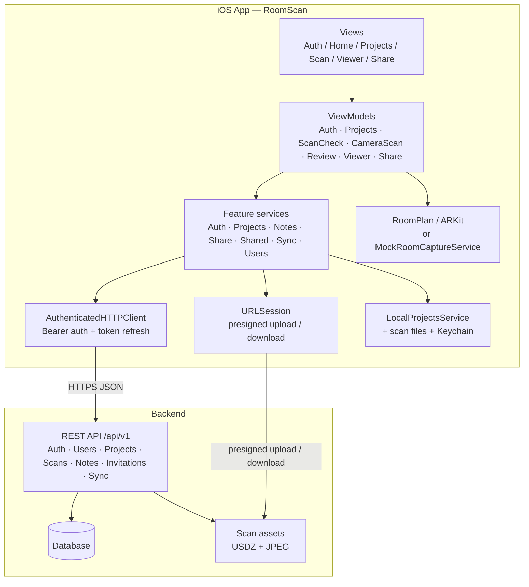
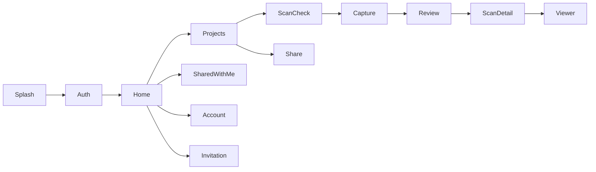
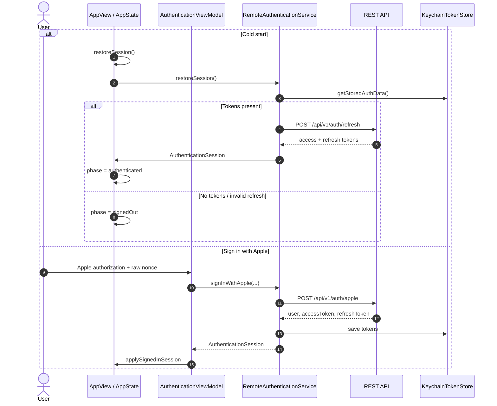
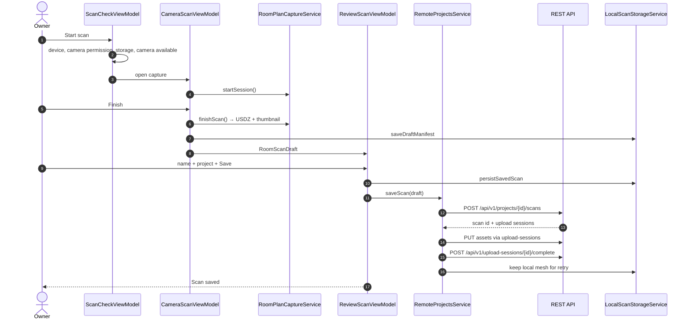
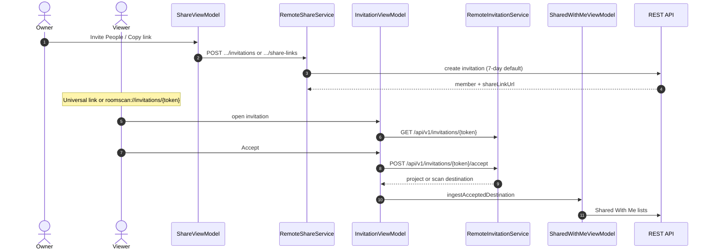
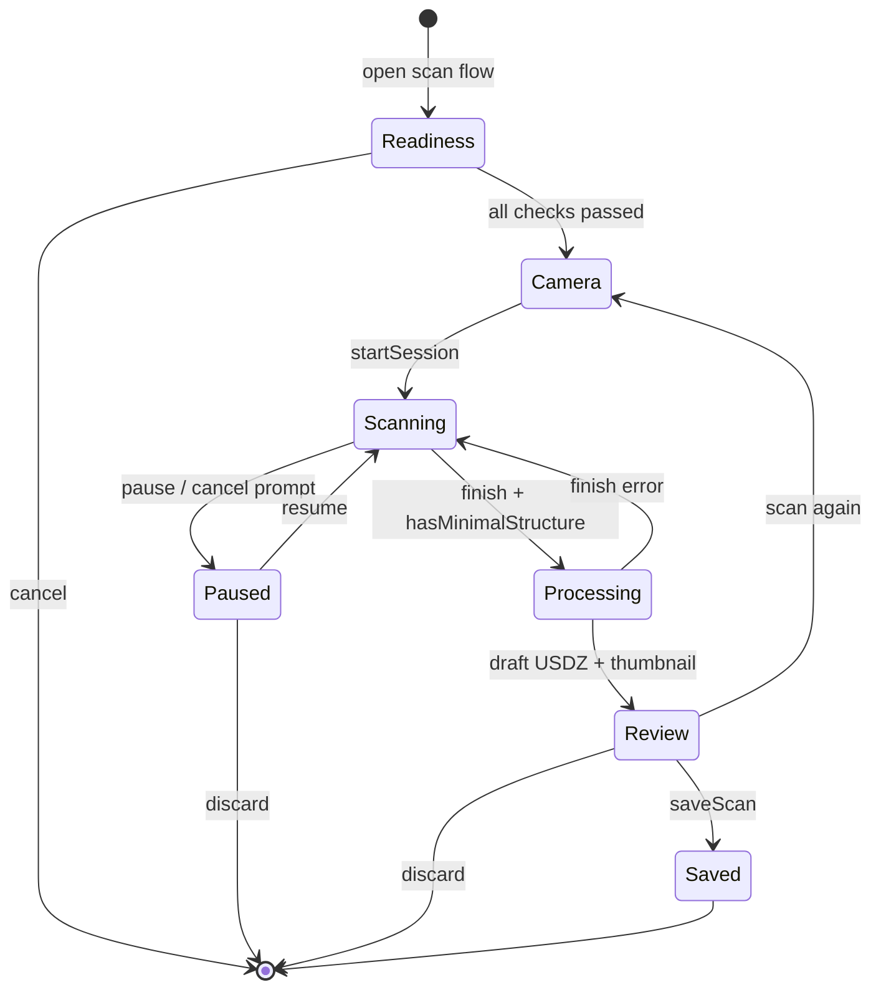
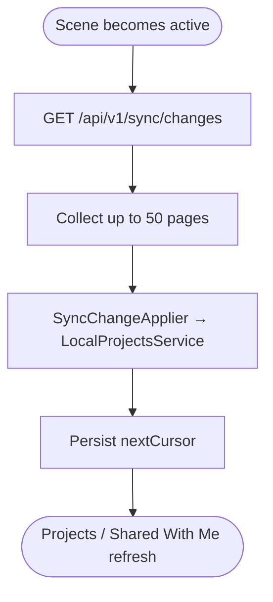
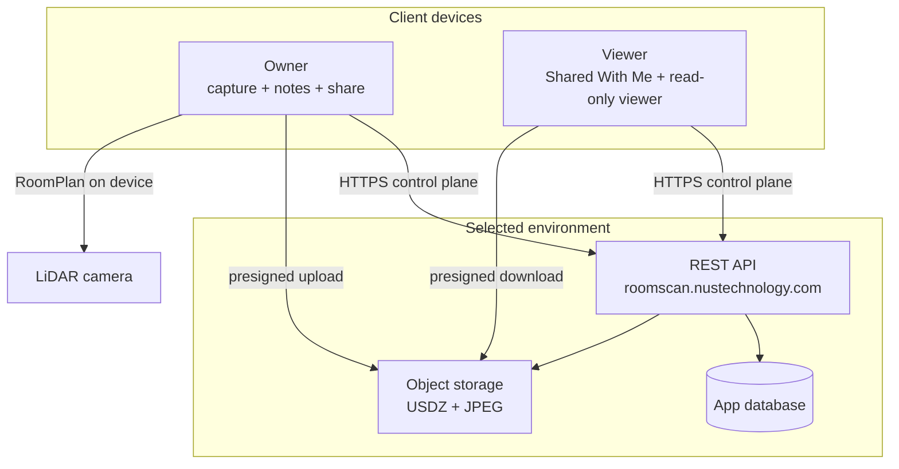
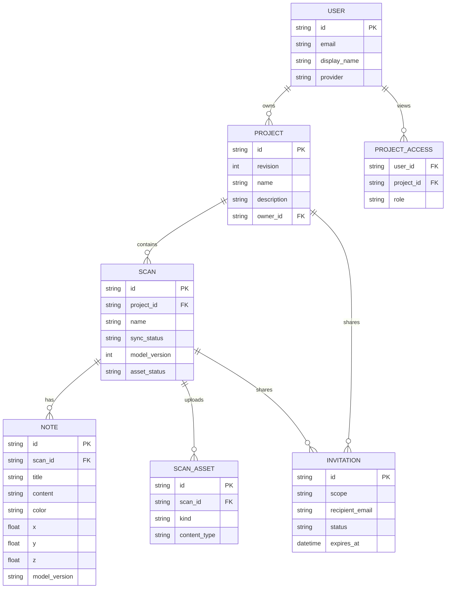

# RoomScan

[](LICENSE)
[](roomscan.xcodeproj)
[](https://swift.org)

**RoomScan** is a demonstration project by [NUS Technology](https://www.nustechnology.com/) exploring native iOS 3D room capture, spatial notes, and multi-scan project sharing.

This repository is the SwiftUI iOS client: users can sign in with Apple, capture rooms, organize scans into projects, place colored notes on the 3D model, and share a project or a single scan with read-only viewers.

Capture runs on-device with **Apple RoomPlan**. Auth, project/scan metadata, notes, invitations, and incremental sync are handled by a **REST API**.

- **Company:** [NUS Technology](https://www.nustechnology.com/)
- **Labs:** [Built by Our Engineers](https://www.nustechnology.com/labs)

## Table of contents

- [Tech stack](#tech-stack)
- [Getting started](#getting-started)
- [Project structure](#project-structure)
- [iOS architecture](#ios-architecture)
- [Sequence diagrams](#sequence-diagrams)
- [Scan lifecycle](#scan-lifecycle)
- [Sync / invitation recovery](#sync--invitation-recovery)
- [Deployment / runtime topology](#deployment--runtime-topology)
- [Conceptual data model](#conceptual-data-model)
- [Main screens](#main-screens)
- [Localization](#localization)
- [Testing](#testing)
- [Conventions](#conventions)
- [Detailed documentation](#detailed-documentation)
- [License](#license)

---

## Tech stack

| Layer | Technology |
|---|---|
| UI | SwiftUI + Observation (`@Observable`) |
| Navigation | Root `AppState.Phase` + tabbed `HomeView` + full-screen covers |
| Architecture | Feature-based MVVM, constructor injection |
| Capture | Apple RoomPlan + ARKit (LiDAR); mock capture in Simulator / UI tests |
| 3D viewer | SceneKit (`RoomModelCanvas`) — 3D and top-down modes |
| Networking | `URLSession` (`LiveHTTPClient`) + Bearer refresh |
| Auth | Sign in with Apple → REST `/api/v1/auth/apple`; tokens in Keychain |
| Persistence | Local JSON cache (`LocalProjectsService`) + scan files on disk |
| Sync | Incremental `GET /api/v1/sync/changes` via `SyncEngine` |
| i18n | String Catalog (`Localizable.xcstrings`) |
| Testing | Swift Testing (`roomscanTests`) + XCTest UI tests |
| Code quality | SwiftLint (strict in the pre-commit hook) |

---

## Getting started

### Prerequisites

- Xcode that can build the `roomscan` scheme (target **iOS 17.6+**)
- The **iPhone 17 Pro** simulator on **iOS 26.5** (the pre-commit hook pins this destination; commits fail without it)
- An Apple Developer team with **Sign in with Apple** capability
- [SwiftLint](https://github.com/realm/SwiftLint) (`brew install swiftlint`) — required by the Git hook; commits fail if it is missing
- A LiDAR-capable iPhone or iPad for live RoomPlan capture (Simulator uses mock capture)
- Reachable REST API at `https://roomscan.nustechnology.com`

### Run

```bash
open roomscan.xcodeproj
```

1. Select the `roomscan` scheme and an iOS Simulator or a LiDAR device.
2. Build and run.
3. Install the shared Git hooks once after cloning:

```bash
./scripts/install-git-hooks.sh
```

RoomPlan furniture preview uses Apple's sample `RoomPlanCatalog.bundle` (WWDC23 *Providing custom models for captured rooms and structure exports*, MIT). License: `roomscan/Resources/RoomPlanCatalog.LICENSE.txt`.

Scan-time still shows parametric boxes. Finish exports a USDZ so Review and the 3D viewer replace recognized tables, chairs, sofas, and some storage with catalog meshes. Categories without a catalog file remain as boxes. Live capture overlay is still boxes.

Verify on a LiDAR device (not Simulator):

1. Scan a room that includes a table or chair.
2. Finish → Review preview shows catalog furniture, not cuboids; walls can have door/window openings.
3. Save and open the 3D viewer — same model.
4. Unrecognized object types may remain boxes.

### Checks

For a one-off `xcodebuild` run, use any installed iPhone simulator. List names and UDIDs with `xcrun simctl list devices available`, then substitute the `-destination` value (`name=…` or `id=<UDID>`).

```bash
swiftlint lint --strict
xcodebuild test \
  -project roomscan.xcodeproj \
  -scheme roomscan \
  -destination 'platform=iOS Simulator,name=iPhone 16' \
  -only-testing:roomscanTests \
  -derivedDataPath .derivedData \
  CODE_SIGNING_ALLOWED=NO
```

The pre-commit hook (`.githooks/pre-commit`) is stricter and is not overridable. It requires SwiftLint (`swiftlint lint --strict`; exits with an install hint if `swiftlint` is missing), runs `git diff --cached --check`, and runs the unit suite against a pinned destination:

```text
platform=iOS Simulator,name=iPhone 17 Pro,OS=26.5
```

That device and runtime must be installed. Commits fail until they are.

### API configuration

The live client uses a single REST base URL in `LiveHTTPClient`:

```swift
baseURL: URL = URL(string: "https://roomscan.nustechnology.com")!
```

There is no per-run env switch. UI tests (`-UITesting`) skip the network and inject mock services from `RoomScanApp`.

---

## Project structure

```text
roomscan/
├── App/                      # Entry, AppState, AppView, deep links
├── Features/
│   ├── Authentication/       # Sign in with Apple
│   ├── Home/                 # Tab shell (Projects / Shared / Account)
│   ├── Projects/             # My projects, scan detail, local cache + upload
│   ├── ScanCheck/            # Pre-scan device / camera / storage checks
│   ├── Scanning/             # RoomPlan capture, review, local draft files
│   ├── Viewer/               # 3D / top-down model + spatial notes
│   ├── ShareProjectAndScan/  # Invite, resend, revoke, share links
│   ├── Shared/               # Shared With Me (projects + scans)
│   ├── Invitations/          # Universal-link accept / decline
│   ├── Sync/                 # Incremental change pull + apply
│   └── Account/              # Profile, storage, pending-sync banner
├── Core/
│   ├── Networking/           # HTTPClient, AuthenticatedHTTPClient
│   ├── Security/             # Keychain token store
│   ├── Telemetry/            # ScanTelemetry
│   └── UI/                   # Design tokens, typography, toasts
├── Shared/                   # Cross-feature UI (buttons, thumbnails)
├── Resources/                # Fonts, RoomPlanCatalog.bundle
├── Localizable.xcstrings
└── Assets.xcassets/
```

Feature layout: **View → ViewModel → Service protocol → Remote / Local / Mock**

```text
Features/{Feature}/
  Views/  ViewModels/  Services/  Models/  Components/
```

Create only the folders a feature actually needs.

---

## iOS architecture

Code-layer view of the iOS client. Runtime nodes (devices, API, object storage) are in [Deployment / runtime topology](#deployment--runtime-topology).



| Layer | Responsibility |
|---|---|
| **Views** | Render state; forward user actions; no business logic |
| **ViewModels** | Screen state, validation, async orchestration (`@MainActor`) |
| **Services** | Feature-owned protocols; isolate REST, RoomPlan, and disk I/O |
| **HTTPClient** | JSON requests (`LiveHTTPClient`) |
| **AuthenticatedHTTPClient** | Wraps `HTTPClient`; Bearer auth; 401/403 → refresh → retry |
| **URLSession (assets)** | Presigned upload (`AssetUploadSession`) and download; no Bearer refresh |
| **Local cache** | Projects JSON + USDZ/JPEG; source of truth while offline |
| **REST** | Auth, metadata, notes, invitations, sync cursors, upload sessions |

`RoomScanApp` composes live vs mock implementations. Views and ViewModels depend on protocols, not concrete backends.

### Feature map



---

## Sequence diagrams

### 1. Sign in and cold start



Idle sessions older than **30 days** (`SessionActivityTracker`) are signed out on restore. Authenticated HTTP calls attach `Authorization: Bearer`; `AuthenticatedHTTPClient` refreshes on 401 (and some 403 token errors) through a single in-flight `AccessTokenRefreshCoordinator`.

### 2. Capture and save a scan (owner)



If asset upload fails, the client marks the upload session failed and deletes the remote scan so a later retry creates a fresh scan (new idempotency key).

### 3. Share and accept (viewer)



Owner-only note create/edit/move/delete is gated in the viewer by `DetailAccessPolicy`. Backend permissions still authorize every request.

---

## Scan lifecycle

Capture states are owned by `ScanFlowCoordinatorView` (`readiness` → `camera` → `review`) and `CameraScanViewModel`.

RoomPlan requires a supported LiDAR device. Simulator and `-UITesting` use `MockRoomCaptureService`. Unsupported devices can still open shared models.

Pre-scan checks (`ScanCheckViewModel`): RoomPlan support, camera permission, ≥ **100 MB** free storage, camera availability.



| Flag / signal | Owner | Meaning |
|---|---|---|
| `allChecksPassed` | ScanCheck | Device, camera, storage, availability |
| `isScanning` / `isPaused` | CameraScan | Live RoomPlan session |
| `hasMinimalStructure` | CameraScan | Finish is enabled |
| `isProcessingFinish` | CameraScan | Exporting USDZ; blocks double-finish |
| `isSaving` | Review | Create-scan + asset upload in flight |
| `syncStatus` | RoomScanSummary | `pending` / `uploading` / `synced` / `failed` / `conflict` |

Idle timer is disabled during capture and restored afterward.

---

## Sync / invitation recovery

Two recovery paths sit on top of local-first data.

### Incremental sync

On becoming active, `RoomScanApp` calls `SyncEngine.pullChanges(forUserId:)`.



Change types: `PROJECT`, `SCAN`, `NOTE`, `SCAN_ASSET`, `PROJECT_ACCESS`. Operations: `UPSERT` / `DELETE`. Sign-out clears the per-user cursor.

### Unfinished capture draft

`ProjectsView` loads `LocalScanStorageService.loadDraftManifest()` and prompts to resume Review or discard. Resuming opens `ScanFlowCoordinatorView` at `.review(draft)` so a killed app does not lose a finished mesh that was never saved.

### Invitation deep link

`AppState.handleIncomingURL` parses:

- `https://roomscan.nustechnology.com/invitations/{token}?scope=project|scan`
- `roomscan://invitations/{token}?scope=project|scan`

If the user is signed out, the pending invitation is kept until after Sign in with Apple.

Accept and decline API failures stay in `InvitationViewModel.actionFailure` and retry through `retryFailedAction(_:)`. After a successful accept, Shared With Me upsert failures stay in `PendingAcceptedSharedIngestQueue` and retry on Shared With Me refresh.

Notes:

- Invitation lifetime defaults to **7 days** (`RemoteShareService.defaultInvitationLifetimeSeconds`).
- Share scopes are **project** or **scan**; permission is view-only.
- Associated domain: `applinks:roomscan.nustechnology.com`.

---

## Deployment / runtime topology

Focus: **which processes talk to which**. The app uses **one** REST base URL (`https://roomscan.nustechnology.com`).



| Plane | Protocol | Examples |
|---|---|---|
| **Control** | HTTPS + JSON | Auth, projects, scans, notes, invitations, sync |
| **Assets** | Presigned HTTP upload/download | `model/usdz`, `image/jpeg` |
| **Capture** | On-device RoomPlan / ARKit | Live mesh; not uploaded as raw camera frames |
| **Secrets on device** | Keychain | Access/refresh tokens |

---

## Conceptual data model

**Not a verified backend schema.** This ER is inferred from client DTOs and API usage. The database engine and exact tables are owned by the backend.

### Confirmed from client payloads

- **USER** — `AuthenticatedUser` / `AuthUserDTO` (`id`, `email`, `displayName`, `provider`)
- **PROJECT** — `ProjectSummary` (name, description, owner, scan count, revision)
- **SCAN** — `RoomScanSummary` / `ScanDetail` (name, thumbnail, mesh, `syncStatus`, `modelVersion`)
- **NOTE** — `NoteDTO` / `SpatialNote` (title, content, color, model-relative position)
- **INVITATION / SHARE** — `InvitedMember`, share links, `SharedProjectItem` / `SharedScanItem`



`SCAN.model_version` is `int` (`ScanDetail.modelVersion`). `NOTE.model_version` is `string` (`NoteDTO.modelVersion`). Notes persist the scan version as `String(scan.modelVersion)`.

| Entity | Confidence | Notes |
|---|---|---|
| **USER** | Confirmed shape | Sign in with Apple; tokens never in `UserDefaults` |
| **PROJECT** | Confirmed shape | Local JSON cache merged with remote list |
| **SCAN** | Confirmed shape | USDZ + JPEG; `syncStatus` is local + API; `modelVersion` is `Int` |
| **NOTE** | Confirmed shape | Position is model-relative; `modelVersion` is `String` (`String(scan.modelVersion)`) |
| **SCAN_ASSET** | Confirmed endpoints | Upload sessions + download-url |
| **INVITATION** | Confirmed shape | Pending / accepted; project or scan scope |
| **PROJECT_ACCESS** | Inferred | Sync `PROJECT_ACCESS` + `/shares/{userId}` |

Runtime-only (not DB tables): `RoomScanDraft`, Keychain tokens, `SyncEngine` cursor, SceneKit camera state.

---

## Main screens

Root UI is selected by `AppState.Phase`. Authenticated users land on `HomeView` tabs. There is no `go_router`-style path table.

| Screen | How you get there |
|---|---|
| Splash | `phase == restoring` |
| Sign in with Apple | `phase == signedOut` |
| Restore failed | `phase == restoreFailed` (Retry) |
| My Projects | Home tab |
| New / edit project | Projects create cover |
| Project detail | Select a project |
| Pre-scan check | Add Room Scan |
| Camera capture | Checks passed |
| Review / save scan | Finish capture, or resume draft |
| Scan detail | Select a scan |
| 3D viewer | Open 3D View |
| Note editor | Owner add / edit note |
| Share | Share project or scan |
| Invitation | Universal link / custom scheme |
| Shared With Me | Home tab (projects + scans subtabs) |
| Account | Home tab |

Deep links:

| URL | Effect |
|---|---|
| `https://roomscan.nustechnology.com/invitations/{token}?scope=project` or `scan` | Pending invitation |
| `roomscan://invitations/{token}?scope=project` or `scan` | Same, custom scheme |

---

## Localization

User-facing copy lives in the String Catalog. Source language is **English**. There is no second locale file yet (Vietnamese is a PRD goal, not shipped).

- Catalog: `roomscan/Localizable.xcstrings`
- Usage: `String(localized: "projects.scan.status.pending")`

Do not hardcode user-visible strings in Views. Prefer the shared design system (`AppTypography`, `AppColors`, `AppSpacing`, `AppCornerRadius`) and the bundled Inter variable font.

---

## Testing

Unit tests live under `roomscanTests/` and mirror feature folders. They use Swift Testing (`@Test`, `#expect`) with in-memory fakes (`MockAuthenticationService`, `MockProjectsService`, …). Avoid real networking, Keychain, and RoomPlan in unit tests.

UI tests (`roomscanUITests`) launch with `-UITesting` so `RoomScanApp` wires mocks.

For a one-off `xcodebuild` run, use any installed iPhone simulator. List names and UDIDs with `xcrun simctl list devices available`, then substitute the `-destination` value (`name=…` or `id=<UDID>`). The pre-commit hook does not use this destination; it pins `iPhone 17 Pro` on iOS **26.5** (see [Checks](#checks)).

```bash
xcodebuild test \
  -project roomscan.xcodeproj \
  -scheme roomscan \
  -destination 'platform=iOS Simulator,name=iPhone 16' \
  -only-testing:roomscanTests \
  -derivedDataPath .derivedData \
  CODE_SIGNING_ALLOWED=NO
```

---

## Conventions

- Follow `docs/architecture.md` and `docs/coding-guidelines.md` for new code.
- Keep feature code inside `Features/<Name>/`. Put types in `Core/` only when two features already share them.
- Inject service protocols through initializers. Do not add a service locator or dependency container.
- Keep UI-observed state on `@MainActor`. Prefer `async`/`await`; let cancellation propagate.
- Store tokens in Keychain. Never log tokens or note content.
- Localize strings; support Dynamic Type; do not convey note meaning by color alone.
- Commit subjects follow `type(scope): summary` (Conventional Commits).

---

## Detailed documentation

Longer product and engineering notes live in `docs/`:

| Document | Scope |
|---|---|
| [App overview](docs/app-overview.md) | Product scope |
| [Product requirements](docs/product-requirements.md) | Target behavior, acceptance criteria, edge cases |
| [Architecture](docs/architecture.md) | Feature MVVM, dependency direction |
| [Coding guidelines](docs/coding-guidelines.md) | Swift / SwiftUI / design-system conventions |
| [Tech stack](docs/tech-stack.md) | Configured technologies |
| [Security checklist](docs/security-checklist.md) | Auth, Keychain, transport, sharing |

AI development guidance is in `.cursor/rules.md` and `CLAUDE.md`, with reusable task prompts under `.cursor/prompts/`.

---

## License

This project is licensed under the [NUS Technology Non-Commercial License 1.0](LICENSE). Commercial use and redistribution are not permitted. For commercial licensing, contact [NUS Technology](https://www.nustechnology.com/).

RoomPlan furniture catalog assets remain under Apple's sample MIT license (`roomscan/Resources/RoomPlanCatalog.LICENSE.txt`).
